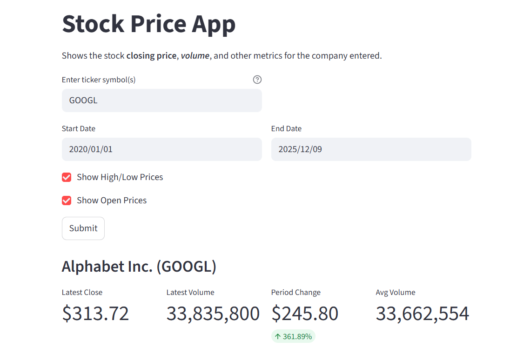
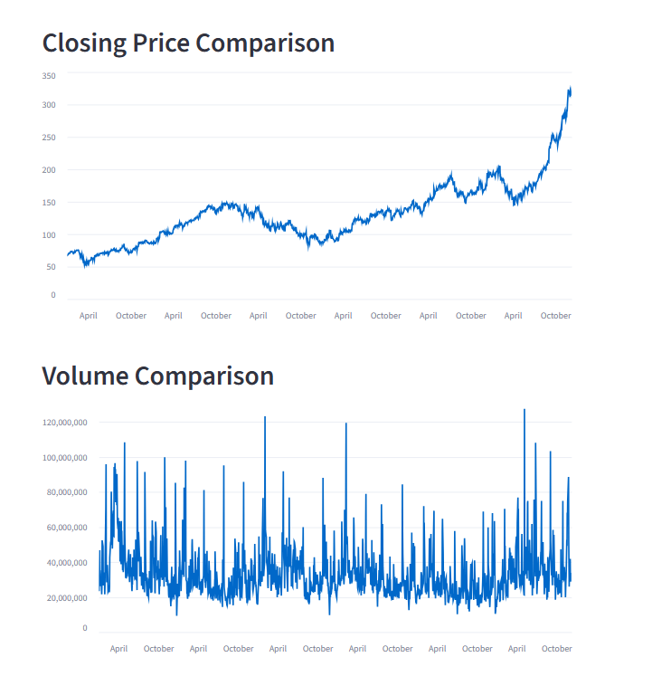

# Stock Price App

## Overview

A Streamlit-based web application for visualizing stock market data. The app allows users to enter ticker symbols, select date ranges, and view stock closing prices, volume, and other metrics using data fetched from Yahoo Finance.

## Getting Started

### Prerequisites

- Python 3.11 or higher
- pip (Python package installer)

### Installation

1. Install the required dependencies:
   ```bash
   pip install -r requirements.txt
   ```
   
   Or install manually:
   ```bash
   pip install streamlit yfinance pandas
   ```

### Running the Application

1. Start the app using the main entry point:
   ```bash
   python main.py
   ```
   
   Alternatively, you can run Streamlit directly:
   ```bash
   streamlit run app.py
   ```

2. The app will automatically open in your default web browser at `http://localhost:8501`

3. If the browser doesn't open automatically, navigate to the URL shown in the terminal

### Application Screenshots

#### Main Page


#### Stock Price Graphs


## User Preferences

Preferred communication style: Simple, everyday language.

## System Architecture

### Frontend Framework
- **Streamlit** - Chosen as the web framework for rapid prototyping of data-driven applications
  - Provides built-in components for charts, metrics, and user inputs
  - No need for separate frontend/backend architecture
  - Python-native, allowing seamless integration with data libraries

### Data Layer
- **yfinance** - Yahoo Finance API wrapper for fetching stock market data
  - Provides historical price data, company info, and financial metrics
  - No API key required for basic usage
  - Returns data as pandas DataFrames for easy manipulation

### Application Structure
- Single-file architecture (`app.py`) suitable for the application's scope
- Modular function design with `get_stock_data()` for data fetching and `display_stock()` for rendering
- Error handling for invalid tickers and API failures

### User Interface Design
- Two-column layout for input fields
- Date range selection with sensible defaults (2020 to present)
- Optional toggles for additional data (High/Low, Open prices)
- Multi-ticker support via comma-separated input

## External Dependencies

### Python Libraries
- **streamlit** - Web application framework
- **yfinance** - Yahoo Finance data fetching
- **pandas** - Data manipulation and analysis

### External APIs
- **Yahoo Finance** - Stock market data source (accessed via yfinance library)
  - No authentication required
  - Rate limits may apply for heavy usage